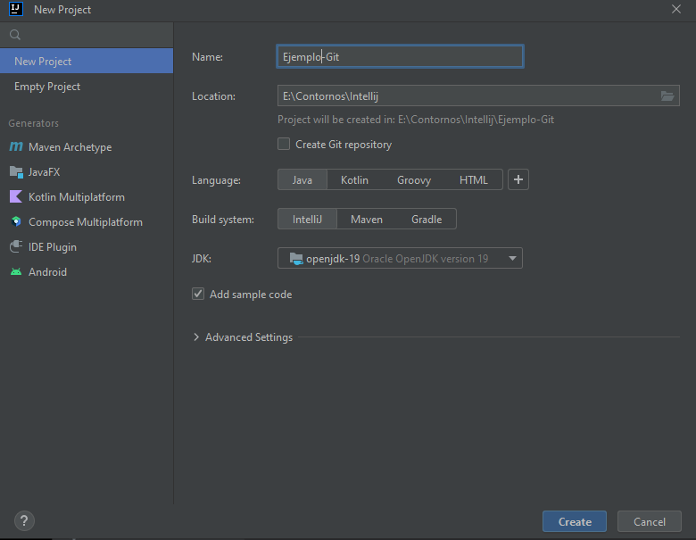

# Ejercicio-GIT
Practicas de uso de git desde terminal

	1 paso crear proyecto con Intellij 
		
	    2 Abro terminal en la carpeta del proyecto y  hago:
		      Git init
		      git add .
		      git commit -m "empiezo nuevo proyecto"
	    
	    3   Ejecuto el main del proyecto y hago commit

	    4   creo un .gitignore con un bloc de notas y le pego una serie de extensiones 
		bajadas de un repositorio de github.

	    5   Copio las clases empleado y main del proyecto original y ejecuto para 
		comprobar que funcionen.

	    6   Borro carpeta out en windows, git status, git add . y commiteo el cambio

	    7	creo el repositorio en github y añado ubicacion remota en git (./img/Añadoremoto.PNG))

	    8   hago push
                $ git push origin master
                Enumerating objects: 31, done.
                Counting objects: 100% (31/31), done.
                Delta compression using up to 4 threads
                Compressing objects: 100% (23/23), done.
                Writing objects: 100% (31/31), 3.92 KiB | 1.96 MiB/s, done.
                Total 31 (delta 5), reused 0 (delta 0), pack-reused 0
                remote: Resolving deltas: 100% (5/5), done.
                To https://github.com/DanielCamposRocha/Ejercicio-GIT.git
                * [new branch]      master -> master

	    9  añado este texto al readme.md

        10  introduzco un TODO en el main
            (git status, git add . , git status, git commit -m "xxx", git status, git push origin master)

	   11  modifico el .gitignore añadiendo extension